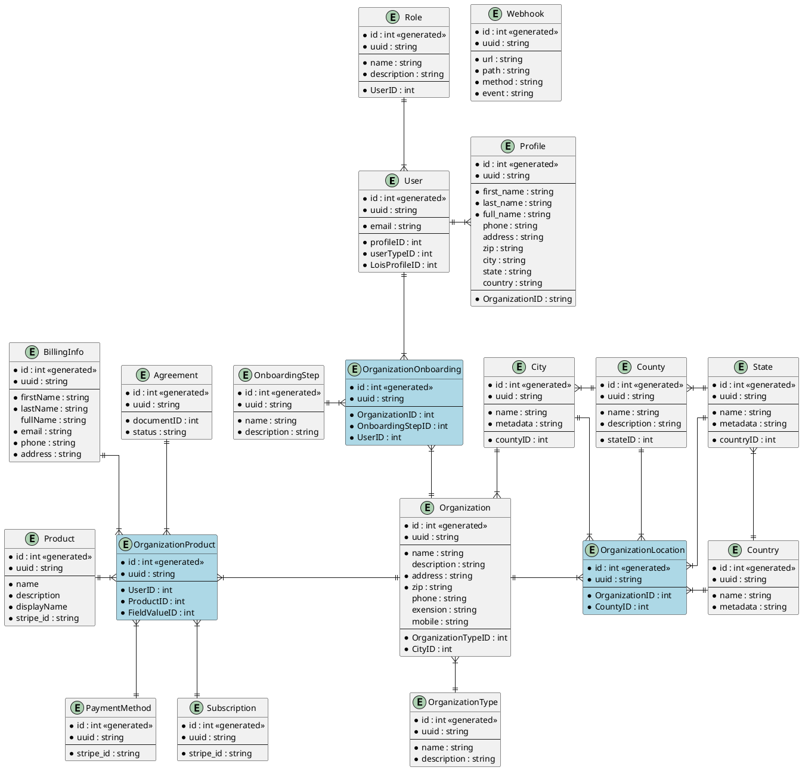

# ERD

The ERD (Entity-Relationship Diagram) is a visual representation of the database schema. It shows the tables and the relationships between them.

```plantuml Your title
@startuml RelatableERD

skinparam linetype ortho

entity User  {
	* id : int <<generated>>
	* uuid : string
	--
	* email : string
	--
	* profileID : int
	* userTypeID : int
	* LoisProfileID : int
}

entity Profile {
	* id : int <<generated>>
	* uuid : string
	--
	* first_name : string
	* last_name : string
	* full_name : string
	phone : string
	address : string
	zip : string
	city : string
	state : string
	country : string
	--
	* OrganizationID : string
}

entity Organization {
	* id : int <<generated>>
	* uuid : string
	--
	* name : string
	description : string
	* address : string
	* zip : string
	phone : string
	exension : string
	mobile : string
	--
	* OrganizationTypeID : int
	* CityID : int
}

entity City {
	* id : int <<generated>>
	* uuid : string
	--
	* name : string
	* metadata : string
	--
	* countyID : int	
}

entity County {
	* id : int <<generated>>
	* uuid : string
	--
	* name : string
	* description : string
	--
	* stateID : int
}

entity State {
	* id : int <<generated>>
	* uuid : string
	--
	* name : string
	* metadata : string
	--
	* countryID : int
}

entity Country {
	* id : int <<generated>>
	* uuid : string
	--
	* name : string
	* metadata : string
}

entity OrganizationLocation #LightBlue {
	* id : int <<generated>>
	* uuid : string
	--
	* OrganizationID : int
	* CountyID : int
}

entity OrganizationType {
	* id : int <<generated>>
	* uuid : string
	--
	* name : string
	* description : string
}

entity Role {
	* id : int <<generated>>
	* uuid : string
	--
	* name : string
	* description : string
	--
	* UserID : int
}

entity Webhook {
	* id : int <<generated>>
	* uuid : string
	--
	* url : string
	* path : string
	* method : string
	* event : string
}

entity Subscription {
	* id : int <<generated>>
	* uuid : string
	--
	* stripe_id : string
}

entity PaymentMethod {
	* id : int <<generated>>
	* uuid : string
	--
	* stripe_id : string
}

entity Product {
	* id : int <<generated>>
	* uuid : string
	--
	* name
	* description
	* displayName
	* stripe_id : string
}

entity OnboardingStep {
	* id : int <<generated>>
	* uuid : string
	--
	* name : string
	* description : string
}

entity OrganizationProduct #LightBlue { 
	* id : int <<generated>>
	* uuid : string
	--
	* UserID : int
	* ProductID : int
	* FieldValueID : int
}

entity OrganizationOnboarding #LightBlue {
	* id : int <<generated>>
	* uuid : string
	--
	* OrganizationID : int
	* OnboardingStepID : int
	* UserID : int
}

entity Agreement {
	* id : int <<generated>>
	* uuid : string
	--
	* documentID : int
	* status : string
}

entity BillingInfo {
	* id : int <<generated>>
	* uuid : string
	--
	* firstName : string
	* lastName : string
	fullName : string
	* email : string
	* phone : string
	* address : string
}

Role ||--|{ User

User ||-right-|{ Profile

OrganizationProduct }|-down-|| PaymentMethod

Organization ||-up-|{ OrganizationOnboarding
OnboardingStep ||-right-|{ OrganizationOnboarding
User ||-down-|{ OrganizationOnboarding

OrganizationType ||-up-|{ Organization

Organization ||-right-|{ OrganizationLocation
City ||--|{ Organization

County ||-down-|{ OrganizationLocation
State ||--|{ OrganizationLocation
Country ||-left-|{ OrganizationLocation
City ||--|{ OrganizationLocation

Country ||-up-|{ State
State ||-left-|{ County
County ||-left-|{ City


Organization ||-left-|{ OrganizationProduct
Product ||-right-|{ OrganizationProduct
Agreement ||-down-|{ OrganizationProduct
BillingInfo ||-down-|{ OrganizationProduct


Subscription ||-up-|{ OrganizationProduct

```