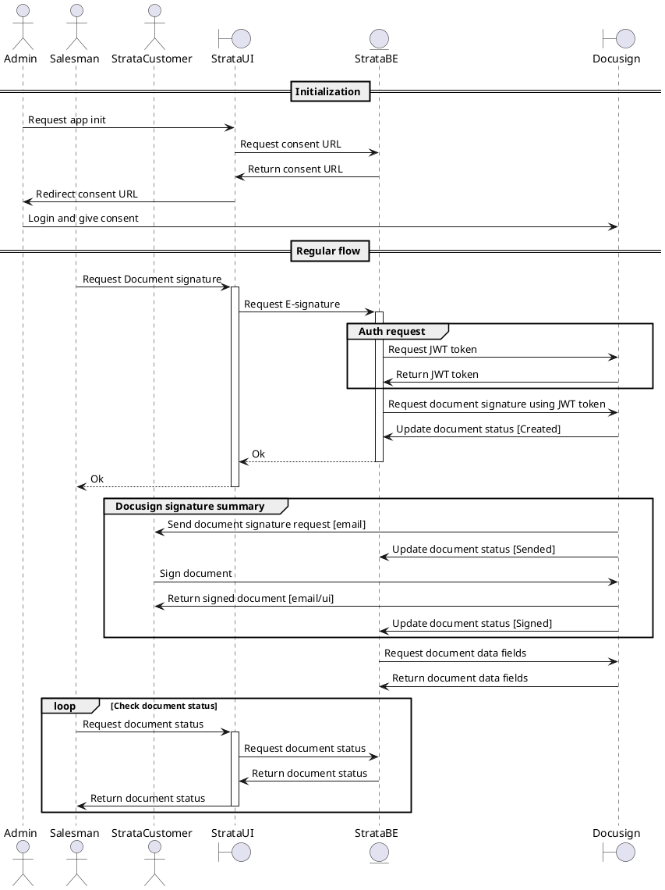

import Collapse from '@site/src/components/Collapse';

# Docusign integration

## Overview

Docusign is a popular e-signature platform that allows you to send, sign, and manage documents digitally. This integration will allow us to send documents to Docusign for signature from within the platform.

## Implementation considerations

### Authentication

Docusign uses OAuth 2.0 for authentication. It offers three different authentication flows: Authorization Code Grant, Implicit Grant, and JWT Grant. Since we are building a server-to-server integration, we will use the JWT Grant flow.

#### Requirements for JWT Grant flow

:::tip Docusign account type from [Docusign node sdk authentication](https://developers.docusign.com/docs/esign-rest-api/sdks/node/auth/)
	> Every Node.js SDK (eSignature as well as others) includes two JWT Grant functions:

	> **requestJWTUserToken**: This function uses the JWT Grant flow to request a token that will represent a specific user. This JWT Grant flow is used for all eSignature REST API methods and for most other DocuSign API methods as well.

	> **requestJWTApplicationToken**: This function uses the JWT Grant flow to request a token that will represent the application itself (not a user). __*This JWT Grant flow is useful for specific DocuSign partners who are part of special DocuSign programs allowing them to manage accounts using the DocuSign Admin API*__.

	As we can see, there are two types of Docusign accounts, one for users and one for applications. We have to discuss with the client which type of account they have and which type of account we will use to integrate with Docusign.
:::

<Collapse title="Pre-requisites for JWT Grant flow">


> - **Integration key (client ID)**: This can be obtained in your developer account from the Apps and Keys page. See the DocuSign eSignature Admin Guide for more information.
> 
> - **RSA private key**: This is for the integration key you obtained above and can also be created on the Apps and Keys page. You only need the private key, and it can only be copied once. Make sure to retain it for your records.
> Base path: To use either JWT Grant function, you need to use an SDK ApiClient object. To create an ApiClient object, you need to provide a base path. Since the application’s correct base path is not yet known, use placeholder values to indicate which system should be queried:
> 
> ```
> https://demo.docusign.net/restapi # development
> https://www.docusign.net/restapi # production
> ```
> 
> Note: This placeholder base path is used only for the ApiClient requestJWTUserToken, requestJWTApplicationToken, and getUserInfo functions. Once you make these calls, you should be able to get the correct base path and use it to make all other API calls.
> 
> - **Impersonated User ID (UserID)**: This is a GUID identifying the DocuSign user that you will be impersonating with the access token. Your own User ID can be found at the top of the Apps and Keys page.
> 
> User IDs for other members of your account can be looked up on the Users page. Locate the user in the list; then use the Actions > Edit button to open the user’s Profile page. The user’s user ID is shown on the page as the User ID value.
> 
> User IDs can also be looked up programmatically by using the Users:list method. It requires administrative permissions.
> 
> This parameter is not used for the requestJWTApplicationToken function.
> 
> - **Scopes**: These represent the OAuth scopes (permissions) that are being requested. For eSignature REST API methods, use the signature scope. The impersonation scope is implied by the JWT Grant operation and does not need to be included. If the access token will be used for other DocuSign APIs, additional scopes may be required; see each API’s authentication requirements.
> 
> - **Parameter formats and additional parameters** are documented in Node.js SDK Reference.
> 
> The JWT Grant flow is used when you want to authenticate as an application, not as a user. The flow is as follows:
</Collapse>

## Docusign relevant endpoints

- [Get envelope](https://developers.docusign.com/docs/esign-rest-api/reference/envelopes/envelopes/get/?explorer=true)
- [Get documents of envelope](https://developers.docusign.com/docs/esign-rest-api/reference/envelopes/envelopedocuments/list/?explorer=true)
- [Get fields of document](https://developers.docusign.com/docs/esign-rest-api/reference/envelopes/envelopeformdata/get/?explorer=true)

## Strata-Docusign integration flow



