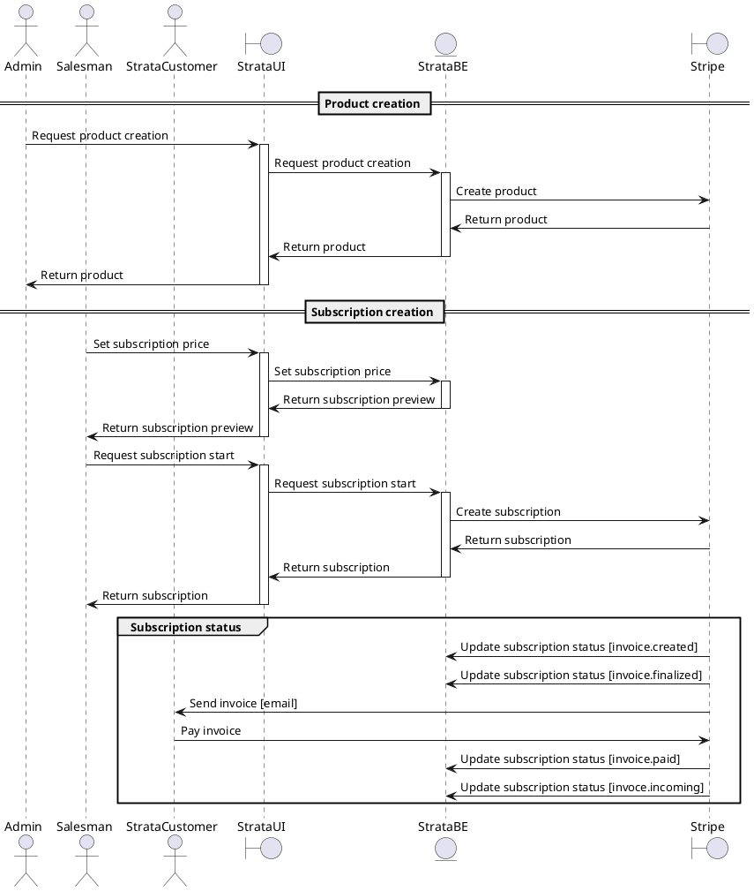

# Stripe integration

## Overview

This integration will allow start and manage subscription plans of the users.

## [Authentication](https://docs.stripe.com/api/authentication)

The Stripe API uses API keys to authenticate requests. in develop mode the key will have the `sk_test_` prefix and in production mode the key will have the `sk_live_` prefix.

## [Users](https://docs.stripe.com/api/customers)

When a user finish its onboarding process, the user will be created in the Stripe platform. The user will be created with the information provided in the docusign fields.

## [Products](https://docs.stripe.com/api/products)

The products will be synced with the local products in the database.

:::tip

No product will have a price. The price will be inputted by the sales team.

:::

## [Subscriptions](https://docs.stripe.com/api/subscriptions)

:::tip tax behavior

The tax behavior must be setted up by Strata when the Stripe account is created.

:::

The subscription will be enabled and priced by the sales team. The subscription will be created with the information provided in the docusign fields.

### Invoices

The subscription payments will be managed by the Stripe platform, using invoices as the collection method. When an invoice is created, the user will be notified by email.

:::warning days_until_due
The invoices have `days_until_due` parameter that sets the number of days until the invoice is due. **PENDIG TO DEFINE** The days until due can be hardcoded in the integration or can be setted up by the sales team, or can be setted dynamicaly by the platform admin.
:::

## Customer Portal

The customer portal will be enabled by Strata when the Stripe account is created. The customer portal will allow the user to manage its subscription, update its payment method, and download its invoices.

## Strata-Stripe integration flow

The following diagram shows the flow of the integration between Strata and Stripe. It only shows the main actions of the integration, the `Customer Portal` is not shown in the diagram since it is a feature of the Stripe platform.

